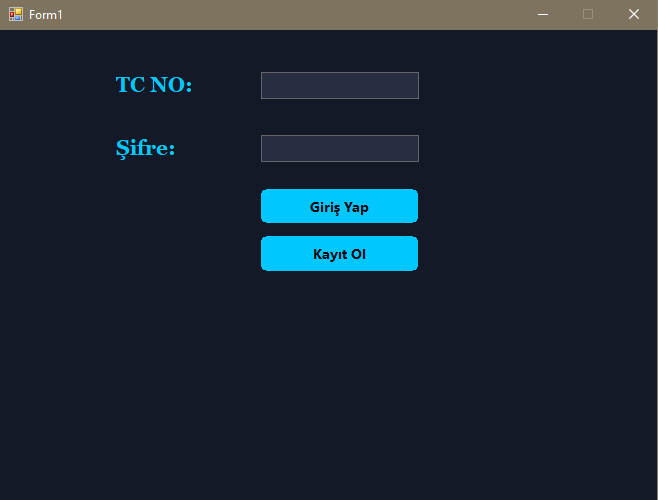
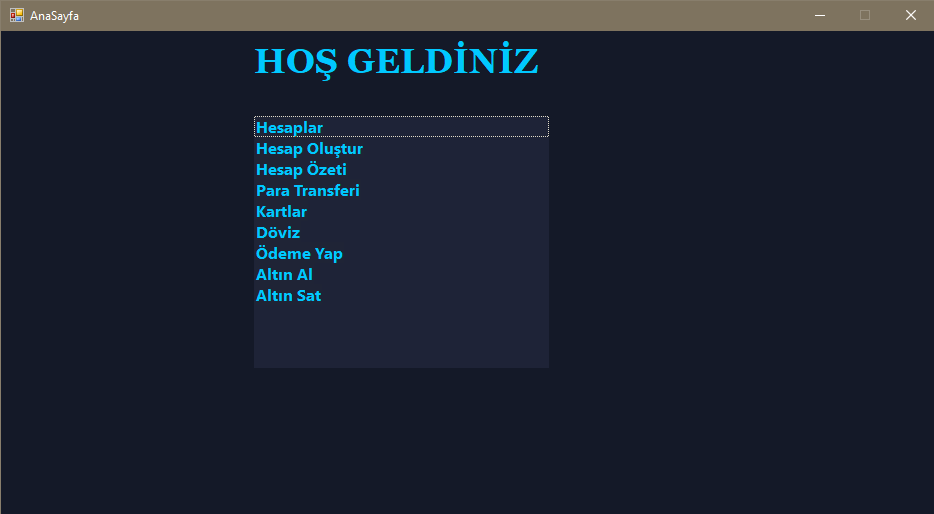

# 🏦 CoreBank - Masaüstü Bankacılık Yönetim Sistemi


Mobil bankacılık deneyimini masaüstü platforma taşıyan, kullanıcıların temel finansal işlemlerini güvenle yönetebildiği, veritabanı destekli (MSSQL) kapsamlı bir finansal simülasyon uygulamasıdır. Kullanıcı dostu arayüzü ile gerçek dünyadaki bankacılık mantığını yazılıma aktarmayı hedeflemektedir.

<div align="center">
  <table border="0">
    <tr>
      <td align="center" width="45%">
        <br>
        <em>Güvenli Giriş Ekranı</em>
      </td>
      <td align="center" width="55%">
        <br>
        <em>Kullanıcı Paneli ve Özellikler</em>
      </td>
    </tr>
  </table>
</div>

## 🚀 Öne Çıkan Özellikler

* **🔐 Kullanıcı Doğrulama:** TC Kimlik No ve şifre ile güvenli giriş ve yeni müşteri kayıt sistemi.
* **💼 Hesap Yönetimi:** Vadesiz TL, Vadeli TL, Dolar ve Altın hesapları oluşturabilme.
* **💸 Para Transferleri:** Alıcı IBAN, Ad-Soyad eşleşmesi ve açıklama ile detaylı para transferi.
* **💳 Kart ve Ödeme İşlemleri:** Kredi/Banka kartı yönetimi ve kurumsal fatura ödemeleri.
* **💱 Döviz ve Altın İşlemleri:** Güncel kur üzerinden simüle edilmiş Dolar ve Gram Altın alım-satım işlemleri.
* **📊 Hesap Özeti:** Tüm hesap hareketlerini tek ekranda listeleyebilme.

## 🛠️ Kullanılan Teknolojiler

* **Geliştirme Ortamı:** Visual Studio
* **Programlama Dili:** C# (Windows Forms)
* **Veritabanı:** Microsoft SQL Server (MSSQL)
* **Veri Erişimi:** ADO.NET (SqlDataReader, SqlCommand)

## ⚙️ Kurulum ve Çalıştırma

1. Repoyu klonlayın:
   ```bash
   git clone [https://github.com/mustafatasdemirr/CoreBank-Desktop-App.git](https://github.com/mustafatasdemirr/CoreBank-Desktop-App.git)